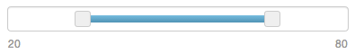
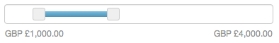
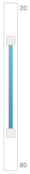
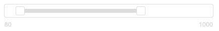
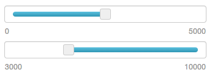
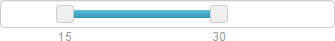
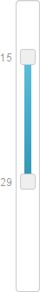

angular-rangeslider
===================
_Current version: 0.0.11_

Angular RangeSlider is a directive that creates an interactive slider that allows a user to change model values.

It has been styled to match form elements styled by [Twitter's Bootstrap CSS framework](http://twitter.github.io/bootstrap/).

#### Requirements

- Angular (v1.0.8+)
- jQuery (v1.7+)

Looking for collaborators
-------------------------

This directive was written for a project completed way back in 2013. I've not needed to use it since and have no plans (or time) to continue development / maintenance.

If anyone would like to become a collaborator please let me know: [@danielcrisp82](https://twitter.com/danielcrisp82)

Installation
------------

Download the files from Github or use Bower:

    $ bower install angular-rangeslider

Add the JS and CSS to your page:

    
    <link rel="stylesheet" href="bower_components/angular-rangeslider/angular.rangeSlider.css">

Add the `ui-rangeSlider` module as a dependency for your app: `angular.module('myApp', ['ui-rangeSlider']);`

Bootstrap is not required.

If you use SCSS & Compass you can include the source SCSS directly into your project CSS if you add `bower_components` to your include path:

    @import "angular-rangeslider/scss/rangeSlider"; // requires Compass

Demo
----

 - [Demo - Angular v.1.1.*](http://danielcrisp.github.io/angular-rangeslider/demo/)
 - [Legacy Demo - Angular v.1.0.*](http://danielcrisp.github.io/angular-rangeslider/demo/legacy.html)

GitHub Pages
------------

[Project page](http://danielcrisp.github.io/angular-rangeslider/)

Quick example
-------------

A basic slider with a range of 0 to 100:

    

As the handles are moved the model values `min` and `max` will be updated in the parent controller.

Options
-------

Options are set as attributes on the `
`

### `=` two-way bindings

`min` - the minimum value the user can select (must be a number, can be a model property)

`max` - the maximum value the user can select (must be a number, can be a model property)

`model-min` - the model property for the min value, represents the position of the min handle

`model-max` - the model property for the max value, represents the position of the max handle

`disabled` - model property or boolean, disables the slider when `true`

### `@` attributes

`orientation` - slider orientation, default: 'horizontal' - options: 'horizontal' | 'vertical' | 'vertical left' | 'vertical right'

`step` - amount to change the value by when moving a handle, default: 0

`decimal-places` - the number of decimal places to round to, default: 0

`filter` - a built-in filter to apply to the displayed values, for example `currency`

`filter-options` - options to pass to the filter

`pin-handle` - disable/hide one handle, default: null - options: 'min' | 'max'

`prevent-equal-min-max` - prevent the `min` and `max` values from being equal. The `step` value is used to set the minimum difference, otherwise a value of `1` is used.

`attach-handle-values` - move the value labels in sync with the slider handles when `true`, default: `false`

Some more examples
------------------

### Using model properties

The following properties are present in the scope:

    // set available range
    $scope.minPrice = 100;
    $scope.maxPrice = 999;
    
    // default the user's values to the available range
    $scope.userMinPrice = $scope.minPrice;
    $scope.userMaxPrice = $scope.maxPrice;
    
So we can include the directive in the HTML like this:

    

As the user moves the min and max handles the `userMinPrice` and `userMaxPrice` will be updated in increments of `5` in real-time in the model.

### Using filters

Continuing from the example above we can format the values displayed to the user as currency.

    

This will automatically be localised by Angular, but we can force it to be USD by passing this as an option:

    

### Making the slider vertical

Simply add one of the following values to the `orientation` attribute: 'vertical', 'vertical left' or 'vertical right'.

This will create a vertical slider that is centred in it's parent element:

    

To left-align the slider use 'vertical left':

    

    
And to right-align the slider use 'vertical right':

    

### Disabling the slider

If you have a boolean property in your scope you can simply change this value to `true` to disable the slider:

    $scope.sliderDisabled = false;

And then specify the property using the disabled attribute:

    

    
    // clicking this button will toggle the sliderDisabled value between true and false
    <button ng-click="sliderDisabled=!sliderDisabled">Toggle slider disabled status</button>
    

### Pinning a handle

If you would like only allow setting one value, effectively creating a single-value silder, set the pin-handle attribute to 'min' or 'max'. You may then omit the corresponding model-xxx property:

    

    

### Move values with handles

Set the attach-handle-values attribute to true to have the values move with the slider handles. This works for either horizontal:

    

or vertical:

    

Angular 1.0.* Support
---------------------

If you use this directive with an older version of Angular (e.g. v1.0.*) then the directive automatically detects this and switches on legacy support.

This basically changes the optional isolate scope properties `disabled`, `modelMin` and `modelMax` so that they are no longer optional and must always be defined on the directive element.

So, this would give an error (`Error: Non-assignable model expression: undefined (directive: rangeSlider)`) if you were using Angular v1.0.8:

    

However this would work correctly:

    

Note, only tested in v1.0.8

To Do
-----

- Remove full jQuery dependency
- Improve behaviour when model values are not valid (e.g. min is greater than max)
- Improve the dev architecture (add jshint, tests, minification, auto-versioning etc)

Known Issues
------------

 - The slider restricts the model value when editing outside the slider (e.g. in an <input>) but the only notification is made to the `console`
 - The min slider handle disappears behind the max slider handle

Credits
-------

This was originally forked from [Léon Gersen's](http://refreshless.com/) brilliant noUiSlider:

https://github.com/leongersen/noUiSlider

Licence
-------

This code is released under the [MIT Licence](http://opensource.org/licenses/MIT)

Copyright (c) 2013 Daniel Crisp

Permission is hereby granted, free of charge, to any person obtaining a copy
of this software and associated documentation files (the "Software"), to deal
in the Software without restriction, including without limitation the rights
to use, copy, modify, merge, publish, distribute, sublicense, and/or sell
copies of the Software, and to permit persons to whom the Software is
furnished to do so, subject to the following conditions:

The above copyright notice and this permission notice shall be included in
all copies or substantial portions of the Software.

THE SOFTWARE IS PROVIDED "AS IS", WITHOUT WARRANTY OF ANY KIND, EXPRESS OR
IMPLIED, INCLUDING BUT NOT LIMITED TO THE WARRANTIES OF MERCHANTABILITY,
FITNESS FOR A PARTICULAR PURPOSE AND NONINFRINGEMENT. IN NO EVENT SHALL THE
AUTHORS OR COPYRIGHT HOLDERS BE LIABLE FOR ANY CLAIM, DAMAGES OR OTHER
LIABILITY, WHETHER IN AN ACTION OF CONTRACT, TORT OR OTHERWISE, ARISING FROM,
OUT OF OR IN CONNECTION WITH THE SOFTWARE OR THE USE OR OTHER DEALINGS IN
THE SOFTWARE.

